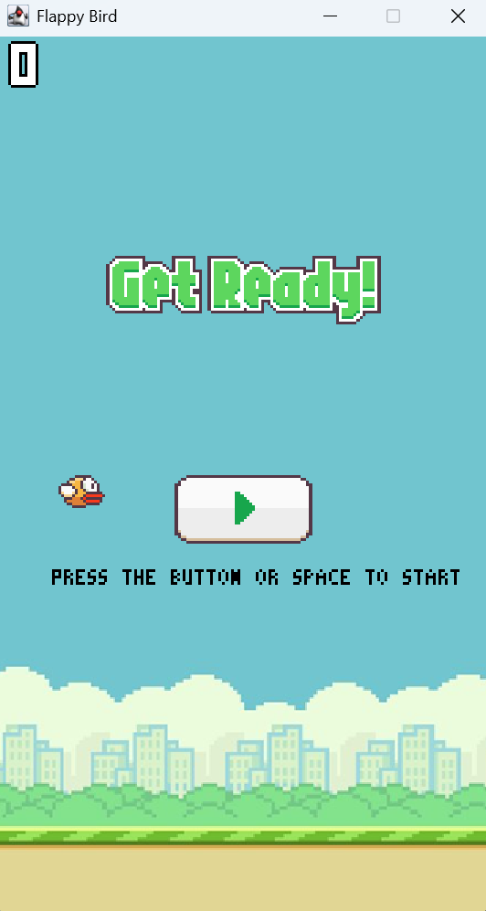
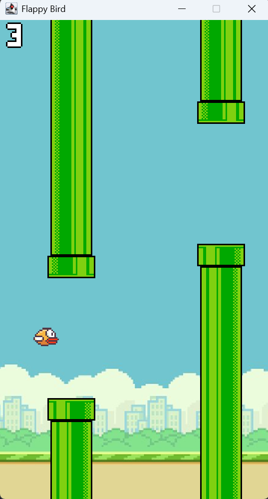
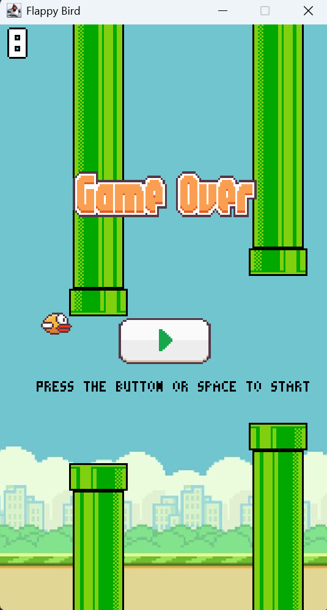

# Flappy Bird (Java Swing)

A simple Flappy Bird clone written in Java Swing.

---
## How to Play
- Press **Space** or click to flap.
- Avoid the pipes and don’t fall.
- Click the play button or press space to start/restart.

  
  
  

---

